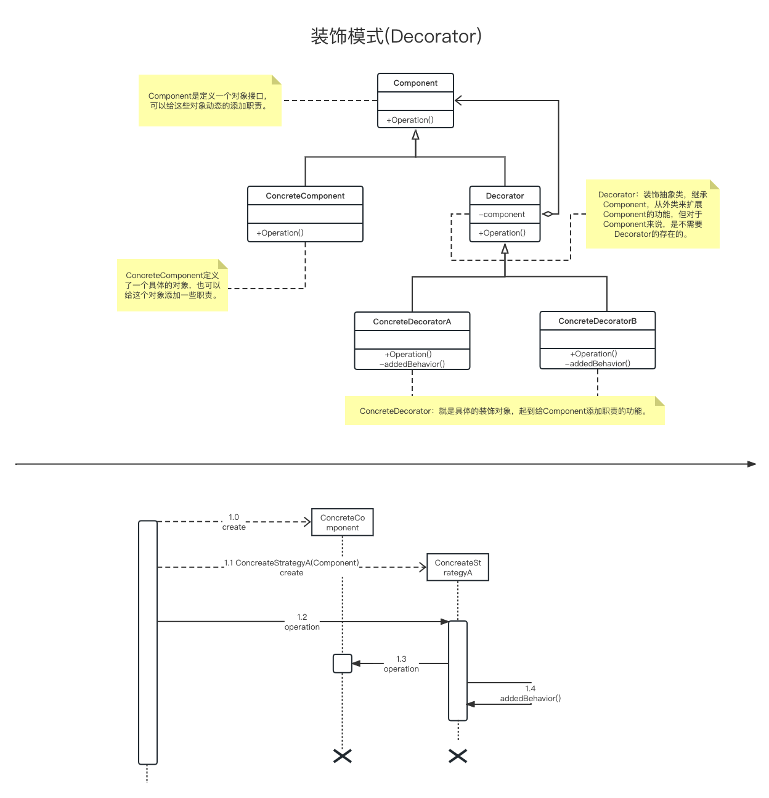
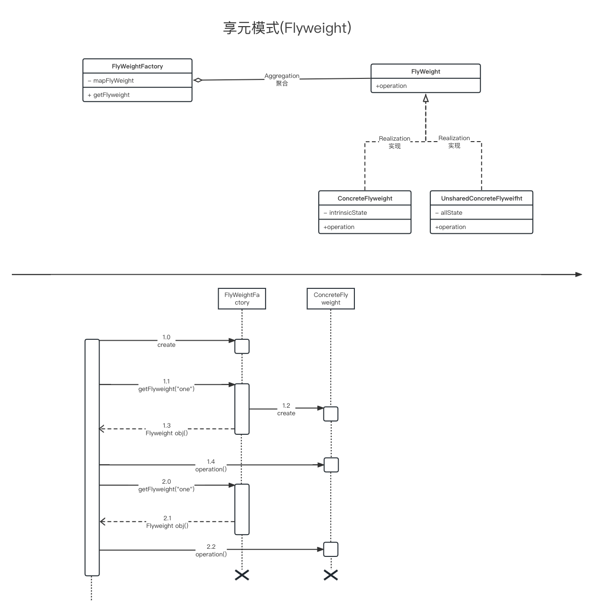
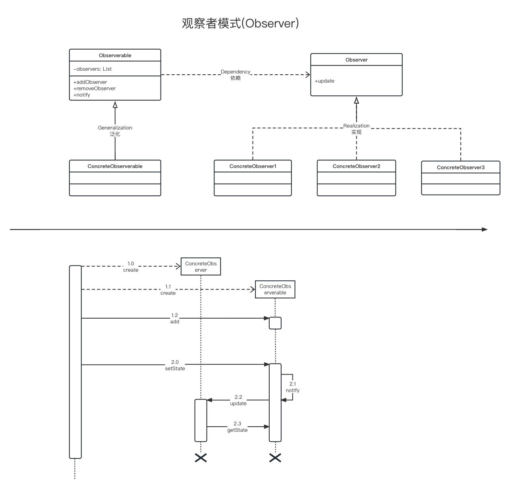
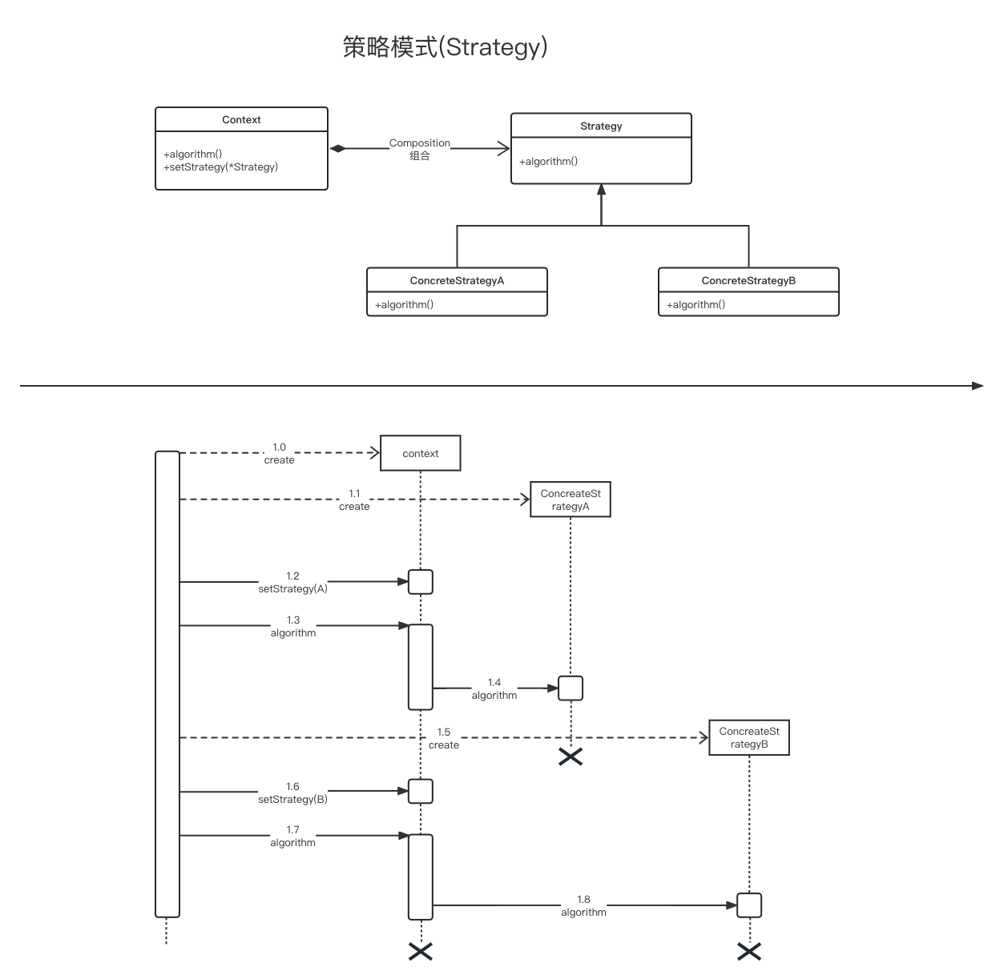

# 设计模式

## 提出问题

- 为什么使用设计模式？
- 设计模式精妙在那里？
- 一定要用吗？怎么用？

## 目标

- 通过uml用例图来快速上手设计模式
- 了解设计模式类型之间的区别
- 通过具体设计模式来感受设计模式的巧妙
- 了解具体设计模式的优点和缺陷
- 商讨设计模式在服务器上平常的使用

## 原则

无论何种设计模式，都是基于六大设计原则：

- 开闭原则：一个软件实体如类、模块和函数应该对修改封闭，对扩展开放。
- œ单一职责原则：一个类只做一件事，一个类应该只有一个引起它修改的原因。
- 里氏替换原则：子类应该可以完全替换父类。也就是说在使用继承时，只扩展新功能，而不要破坏父类原有的功能。
- 依赖倒置原则：细节应该依赖于抽象，抽象不应依赖于细节。把抽象层放在程序设计的高层，并保持稳定，程序的细节变化由低层的实现层来完成。
- 迪米特法则：又名“最少知道原则”，一个类不应知道自己操作的类的细节，换言之，只和朋友谈话，不和朋友的朋友谈话。
- 接口隔离原则：客户端不应依赖它不需要的接口。如果一个接口在实现时，部分方法由于冗余被客户端空实现，则应该将接口拆分，让实现类只需依赖自己需要的接口方法。

## 类型

### 创建型

- 工厂模式 Factory
- 抽象工厂模式 Abstract factory
- 单例模式 Singleton
- 建造者模式 Builder
- 原型模式 Prototype

### 结构型

- 适配器模式 Adapter
- 桥接模式 Bridge
- 组合模式 Composite
- 装饰模式 Decorator
- 外观模式 Facade
- 享元模式 Flyweight
- 代理模式 Proxy

### 行为型

- 责任链模式 Chain of responsibility
- 命令模式 Command
- 解释器模式 Interpreter
- 迭代器模式 Iterator
- 中介者模式 Mediator
- 备忘录模式 Memento
- 观察者模式 Observer
- 状态模式 State
- 策略模式 Strategy
- 模板方法模式 Template method
- 访问者模式 Visitor

## 具体模式

### 结构型

#### 装饰模式

**简介：**

装饰模式来实现扩展比继承更加灵活，它以对客户透明的方式动态地给一个对象附加更多的责任。装饰模式可以在不需要创造更多子类的情况下，将对象的功能加以扩展。



**优点：**

* 装饰模式与继承关系的目的都是要扩展对象的功能，但是装饰模式可以提供比继承更多的灵活性。
* 可以通过一种动态的方式来扩展一个对象的功能，通过配置文件可以在运行时选择不同的装饰器，从而实现不同的行为。
* 通过使用不同的具体装饰类以及这些装饰类的排列组合，可以创造出很多不同行为的组合。可以使用多个具体装饰类来装饰同一对象，得到功能更为强大的对象。
* 具体构件类与具体装饰类可以独立变化，用户可以根据需要增加新的具体构件类和具体装饰类，在使用时再对其进行组合，原有代码无须改变，符合“开闭原则”

**缺点：**

* 使用装饰模式进行系统设计时将产生很多小对象，这些对象的区别在于它们之间相互连接的方式有所不同，而不是它们的类或者属性值有所不同，同时还将产生很多具体装饰类。这些装饰类和小对象的产生将增加系统的复杂度，加大学习与理解的难度。
* 这种比继承更加灵活机动的特性，也同时意味着装饰模式比继承更加易于出错，排错也很困难，对于多次装饰的对象，调试时寻找错误可能需要逐级排查，较为烦琐。

**适用：**

* 在不影响其他对象的情况下，以动态、透明的方式给单个对象添加职责。
* 需要动态地给一个对象增加功能，这些功能也可以动态地被撤销。
* 当不能采用继承的方式对系统进行扩充或者采用继承不利于系统扩展和维护时。不能采用继承的情况主要有两类：第一类是系统中存在大量独立的扩展，为支持每一种组合将产生大量的子类，使得子类数目呈爆炸性增长；第二类是因为类定义不能继承（如final类）.

**意图以及解决：**

- 动态地给一个对象添加一些额外的职责。就增加功能来说，装饰器模式相比生成子类更为灵活。
- 一般的，我们为了扩展一个类经常使用继承方式实现，由于继承为类引入静态特征，并且随着扩展功能的增多，子类会很膨胀。

**解决方式：**

- 将具体功能职责划分，同时继承装饰者模式。


#### 享元模式

**简介：**

考虑系统性能的设计模式，通过使用享元模式可以节约内存空间，提高系统的性能。

核心在于享元工厂类，享元工厂类的作用在于提供一个用于存储享元对象的享元池，用户需要对象时，首先从享元池中获取，如果享元池中不存在，则创建一个新的享元对象返回给用户，并在享元池中保存该新增对象。



**优点：**

* 享元模式的优点在于它可以极大减少内存中对象的数量，使得相同对象或相似对象在内存中只保存一份。
* 享元模式的外部状态相对独立，而且不会影响其内部状态，从而使得享元对象可以在不同的环境中被共享。

**缺点：**

* 享元模式使得系统更加复杂，需要分离出内部状态和外部状态，这使得程序的逻辑复杂化。
* 为了使对象可以共享，享元模式需要将享元对象的状态外部化，而读取外部状态使得运行时间变长。

**适用：**

* 一个系统有大量相同或者相似的对象，由于这类对象的大量使用，造成内存的大量耗费。
* 对象的大部分状态都可以外部化，可以将这些外部状态传入对象中。
* 使用享元模式需要维护一个存储享元对象的享元池，而这需要耗费资源，因此，应当在多次重复使用享元对象时才值得使用享元模式。

**意图以及解决：**

- 运用共享技术有效地支持大量细粒度的对象。
- 在有大量对象时，有可能会造成内存溢出，我们把其中共同的部分抽象出来，如果有相同的业务请求，直接返回在内存中已有的对象，避免重新创建。

**解决方式：**

- 用唯一标识码判断，如果在内存中有，则返回这个唯一标识码所标识的对象。


### 行为性

#### 观察者模式

**简介：**

观察者模式中的关键对象是观察目标和观察者，一个目标可以有任意数目的与之相依赖的观察者，一旦目标的状态发生改变，所有的观察者都将得到通知。

作为对这个通知的响应，每个观察者都将即时更新自己的状态，以与目标状态同步，这种交互也称为发布-订阅(publishsubscribe)。目标是通知的发布者，它发出通知时并不需要知道谁是它的观察者，可以有任意数目的观察者订阅它并接收通



**优点：**

* 观察者模式可以实现表示层和数据逻辑层的分离，并定义了稳定的消息更新传递机制，抽象了更新接口，使得可以有各种各样不同的表示层作为具体观察者角色。
* 观察者模式在观察目标和观察者之间建立一个抽象的耦合。
* 观察者模式支持广播通信。
* 观察者模式符合“开闭原则”的要求。

**缺点：**

* 如果一个观察目标对象有很多直接和间接的观察者的话，将所有的观察者都通知到会花费很多时间。（异步）
* 如果在观察者和观察目标之间有循环依赖的话，观察目标会触发它们之间进行循环调用，可能导致系统崩溃。
* 观察者模式没有相应的机制让观察者知道所观察的目标对象是怎么发生变化的，而仅仅只是知道观察目标发生了变化。（包装通知）

**适用：**

* 一个抽象模型有两个方面，其中一个方面依赖于另一个方面。将这些方面封装在独立的对象中使它们可以各自独立地改变和复用。
* 一个对象的改变将导致其他一个或多个对象也发生改变，而不知道具体有多少对象将发生改变，可以降低对象之间的耦合度。
* 一个对象必须通知其他对象，而并不知道这些对象是谁。
* 需要在系统中创建一个触发链，A对象的行为将影响B对象，B对象的行为将影响C对象……，可以使用观察者模式创建一种链式触发机制。

**意图以及解决：**

- 定义对象间的一种一对多的依赖关系，当一个对象的状态发生改变时，所有依赖于它的对象都得到通知并被自动更新。
- 一个对象状态改变给其他对象通知的问题，而且要考虑到易用和低耦合，保证高度的协作。

**解决方式：**

- 使用面向对象技术，可以将这种依赖关系弱化。在抽象类里有一个 ArrayList 存放观察者们。


#### 策略模式

**简介：**

策略模式是对算法的封装，它把算法的责任和算法本身分割开，委派给不同的对象管理。

（就是“准备一组算法，并将每一个算法封装起来，使得它们可以互换”。）

客户端需要理解所有具体策略类之间的区别，以便选择合适的算法，这也是策略模式的缺点之一，在一定程度上增加了客户端的使用难度。



**优点：**

* 策略模式提供了对“开闭原则”的完美支持，用户可以在不修改原有系统的基础上选择算法或行为，也可以灵活地增加新的算法或行为。
* 策略模式提供了管理相关的算法族的办法。
* 策略模式提供了可以替换继承关系的办法。
* 使用策略模式可以避免使用多重条件转移语句。

**缺点：**

* 客户端必须知道所有的策略类，并自行决定使用哪一个策略类。
* 策略模式将造成产生很多策略类。（可以通过使用享元模式在一定程度上减少对象的数量）

**适用：**

* 如果在一个系统里面有许多类的区别仅在于它们的行为，那么使用策略模式可以动态地让一个对象在许多行为中选择一种行为。
* 一个系统需要动态地在几种算法中选择一种。
* 如果一个对象有很多的行为，如果不用恰当的模式，这些行为就只好使用多重的条件选择语句来实现。
* 不希望客户端知道复杂的、与算法相关的数据结构，在具体策略类中封装算法和相关的数据结构，提高算法的保密性与安全性。

**意图以及解决：**

- 定义一系列的算法,把它们一个个封装起来, 并且使它们可相互替换。
- 在有多种算法相似的情况下，使用 if...else 所带来的复杂和难以维护。

**解决方式：**

- 将这些算法封装成一个一个的类，任意地替换。


## 总结

#### 设计模式是一种解决方案

设计模式为我们提供了一种解决问题的方案，它不一定是该问题的最优解，但是为我们提供了一种思路。

将视角放在设计模式的意图和主要解决上，可以为你的问题快速选中一个解决方式

一组事例代码

```go
package main

import "fmt"

type Server interface {
	doServer()
}

type BaseServer struct {
}

func (b *BaseServer) doServer() {
	fmt.Println("执行命令")
}

// 代理模式

type ServerProxy struct {
	base BaseServer
}

func NewServerProxy() (srvProxy *ServerProxy) {
	return &ServerProxy{}
}

func (p *ServerProxy) preServer() {
	fmt.Println("前置处理")
}

func (p *ServerProxy) doServer() {
	p.preServer()
	p.base.doServer()
}

// 装饰模式

type ServerDecorator struct {
	srv Server
}

func NewServerDecorator(srv Server) (srvDecorator *ServerDecorator) {
	return &ServerDecorator{
		srv: srv,
	}
}

func (d *ServerDecorator) doServer() {
	fmt.Println("前置处理")
	d.srv.doServer()
}

func main() {
	base := &BaseServer{}
	base.doServer()

	fmt.Println()
	fmt.Println("================================")
	fmt.Println()

	// 装饰者模式实现
	decorator := NewServerDecorator(base)
	decorator.doServer()

	fmt.Println()
	fmt.Println("================================")
	fmt.Println()

	// 代理模式实现
	proxy := NewServerProxy()
	proxy.doServer()

	fmt.Println()
}

```

#### 设计模式的uml图妙处

关于uml类图，首先可以快速了解设计模式的结构；其次可以让我们了解该模式是如何保证扩展性的。

关于uml时序图，可以快速了解到设计模式的使用流程。可以和业务上的流程作为对比，就可以了解该模式是否适用。


## 参考

- https://design-patterns.readthedocs.io/zh_CN/latest/index.html
- https://www.runoob.com/design-pattern/design-pattern-tutorial.html
- https://github.com/senghoo/golang-design-pattern
- https://github.com/lee501/go-patterns
- https://github.com/me115/design_patterns
